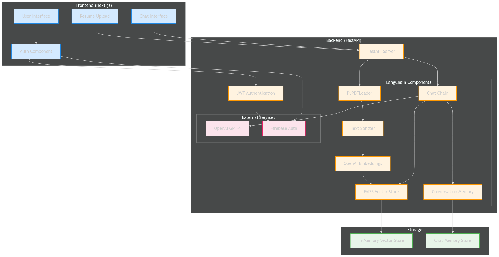

# Resume Chat AI Backend

A FastAPI backend service that uses LangChain and OpenAI to analyze resumes and provide intelligent responses to queries about the resume content.

Frontend Repository: [Resume Chat AI UI](https://github.com/harshit17sharma09/resume-with-AI-UI)

## System Design

### Architecture Overview


### LangChain Implementation Flow


### Key Components

1. **Document Processing**
   - PyPDFLoader: Extracts text from PDF resumes
   - CharacterTextSplitter: Splits text into manageable chunks
   - Chunk size: 1000 characters
   - Overlap: 200 characters

2. **Vector Store**
   - OpenAI Embeddings: Converts text to vectors
   - FAISS: Stores vectors for similarity search
   - In-memory storage per user session

3. **Conversation Management**
   - ConversationBufferMemory: Maintains chat history
   - User-specific memory storage
   - Context-aware responses

4. **LLM Integration**
   - Model: GPT-4
   - Temperature: 0.7
   - Custom prompt templates
   - Context window: Up to 8k tokens

## Screenshots

### Home Interface

### Chat Interface


## Features

- PDF resume processing and analysis
- Conversational AI powered by GPT-4 and LangChain
- Vector storage for efficient document retrieval
- JWT-based authentication
- Firebase integration for user management
- Conversation memory management

## Prerequisites

- Python 3.8+
- OpenAI API key
- Firebase Admin credentials
- Git

## Installation

1. Clone the repository

bash
git clone https://github.com/harshit17sharma09/resume-with-AI-backend.git
cd resume-with-AI-backend

2. Create and activate virtual environment
```bash
python -m venv venv
source venv/bin/activate  # On Windows: venv\Scripts\activate
```

3. Install dependencies
```bash
pip install -r requirements.txt
```

4. Create a `.env` file in the root directory and add your environment variables:
```env
OPENAI_API_KEY=your_openai_api_key
JWT_SECRET_KEY=your_jwt_secret_key
JWT_ALGORITHM=HS256
```

5. Add your Firebase credentials
- Create a `firebase-admin-credentials.json` file in the root directory
- Add your Firebase Admin SDK credentials to this file

## Running the Application

1. Start the FastAPI server:
```bash
uvicorn main:app --reload
```

2. The API will be available at `http://localhost:8000`
3. Access the API documentation at `http://localhost:8000/docs`

## API Endpoints

### Authentication
- `POST /request-access`: Request access to the application
- `POST /clear-chat`: Clear chat history for a user

### Chat
- `POST /chat`: Process resume and chat with AI about its contents

## Project Structure
```
resume-with-AI-backend/
├── main.py              # Main application file
├── requirements.txt     # Python dependencies
├── .env                # Environment variables
├── .gitignore          # Git ignore file
└── firebase-admin-credentials.json  # Firebase credentials
```

## Dependencies

Main dependencies include:
- fastapi
- langchain
- langchain-community
- langchain-openai
- openai
- firebase-admin
- python-jose[cryptography]
- python-multipart
- uvicorn
- pydantic
- python-dotenv
- faiss-cpu
- pypdf

## Error Handling

Common errors and solutions:
1. `ModuleNotFoundError`: Run `pip install -r requirements.txt`
2. `Invalid credentials`: Check your `.env` file and Firebase credentials
3. `Authorization error`: Ensure proper JWT token in request headers

## Security

- All endpoints require JWT authentication
- Environment variables are used for sensitive data
- Firebase Admin SDK for user management
- CORS middleware configured for security

## Contributing

1. Fork the repository
2. Create your feature branch
3. Commit your changes
4. Push to the branch
5. Create a Pull Request

## License

This project is licensed under the MIT License - see the LICENSE file for details